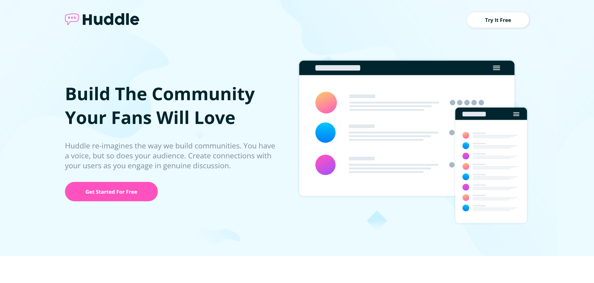

# Frontend Mentor - Huddle landing page with alternating feature blocks solution

This is a solution to the [Huddle landing page with alternating feature blocks challenge on Frontend Mentor](https://www.frontendmentor.io/challenges/huddle-landing-page-with-alternating-feature-blocks-5ca5f5981e82137ec91a5100). Frontend Mentor challenges help you improve your coding skills by building realistic projects. 

## Table of contents

- [Overview](#overview)
  - [The challenge](#the-challenge)
  - [Screenshot](#screenshot)
  - [Links](#links)
- [My process](#my-process)
  - [Built with](#built-with)
  - [What I learned](#what-i-learned)
  - [Continued development](#continued-development)
  - [Useful resources](#useful-resources)
- [Author](#author)
- [Acknowledgments](#acknowledgments)

## Overview

### The challenge

Users should be able to:

- View the optimal layout for the site depending on their device's screen size
- See hover states for all interactive elements on the page

### Screenshot


 - Screenshot of Project

### Links

- Live Site URL: [Live Server URL](https://your-live-site-url.com)

## My process

### Built with

- Semantic HTML5 markup
- CSS custom properties
- Flexbox
- CSS Grid
- Mobile-first workflow

### What I learned

I have learned how to make simple templates using HTML and CSS with help of flex properties and grid properties .

Observe below code for given project.

```html
<!DOCTYPE html>
<html lang="en">

<head>
    <meta charset="UTF-8">
    <meta name="viewport" content="width=device-width, initial-scale=1.0">
    <link rel="icon" type="image/png" sizes="32x32" href="./images/favicon-32x32.png">
    <link rel="stylesheet" href="style.css">
    <link rel="stylesheet" href="https://cdnjs.cloudflare.com/ajax/libs/font-awesome/6.4.0/css/all.min.css"
        integrity="sha512-iecdLmaskl7CVkqkXNQ/ZH/XLlvWZOJyj7Yy7tcenmpD1ypASozpmT/E0iPtmFIB46ZmdtAc9eNBvH0H/ZpiBw=="
        crossorigin="anonymous" referrerpolicy="no-referrer" />
    <title>Frontend Mentor | Huddle landing page with alternating feature blocks</title>
</head>

<body>

    <div id="wrapper">
        <div class="container">
            <div class="navbar">
                <div class="logo">
                    
                </div>
                <div class="button try">
                    <button>Try It Free</button>
                </div>
            </div>
            <div class="hero-section">
                <div class="content">
                    <div class="head-hero">
                        <h2>
                            Build The Community Your Fans Will Love
                        </h2>
                    </div>
                    <div class="para-hero">
                        <p>
                            Huddle re-imagines the way we build communities. You have a voice, but so does your
                            audience.
                            Create connections with your users as you engage in genuine discussion.
                        </p>
                    </div>
                    <div class="button hb">
                        <button>
                            Get Started For Free
                        </button>
                    </div>
                </div>
                <div class="img-hero">
                    
                </div>
            </div>
        </div>

        <div class="triple-box">
            <div class="box box1">
                <div class="b1-content">
                    <div class="b1-head">
                        <h2>
                            Grow Together
                        </h2>
                    </div>
                    <div class="b1-para">
                        <p>
                            Generate meaningful discussions with your audience and build a strong, loyal community.
                            Think of the insightful conversations you miss out on with a feedback form.
                        </p>
                    </div>
                </div>
                <div class="b1-img">
                    
                </div>
            </div>

            <div class="box box2">
                <div class="b1-img">
                    
                </div>
                <div class="b1-content">
                    <div class="b1-head">
                        <h2>
                            Flowing Conversations
                        </h2>
                    </div>
                    <div class="b1-para">
                        <p>
                            You wouldn't paginate a conversation in real life, so why do it online? Our threads
                            have just-in-time loading for a more natural flow.
                        </p>
                    </div>
                </div>
            </div>

            <div class="box box3">
                <div class="b1-content">
                    <div class="b1-head">
                        <h2>
                            Your Users
                        </h2>
                    </div>
                    <div class="b1-para">
                        <p>
                            It takes no time at all to integrate Huddle with your app's authentication solution.
                            This means, once signed in to your app, your users can start chatting immediately.
                        </p>
                    </div>
                </div>
                <div class="b1-img">
                    
                </div>
            </div>

            <div class="last1">
                <div class="mid-box">
                    <div class="head-last">
                        <h4>
                            Ready To Build Your Community?
                        </h4>
                    </div>
                    <div class="button lb">
                        <button>
                            Get Started For Free
                        </button>
                    </div>
                </div>
            </div>

            <div class="end">
                <div class="end-content">
                    <div class="data">
                        <div class="img-end ei">
                            
                        </div>
                        <div class="loc">
                            
                            <p>
                                Lorem ipsum dolor sit amet, consectetur adipiscing
                                elit, sed do eiusmod tempor incididunt ut labore et
                                dolore magna aliqua
                            </p>
                        </div>
                        <div class="con">
                            
                            <p>
                                +1-543-123-4567
                            </p>
                        </div>
                        <div class="mail">
                            
                            <p>
                                example@huddle.com
                            </p>
                        </div>
                    </div>

                    <div class="links">
                        <a href="#" class="ab">About Us</a>
                        <a href="#" class="qe">What We Do</a>
                        <a href="#" class="faq">FAQ</a>
                    </div>

                    <div class="option">
                        <div class="name1">Career</div>
                        <div class="name2">Blog</div>
                        <div class="name3">Contact Us</div>
                    </div>

                    <div class="icon1">
                        <i class="fa-brands fa-facebook-f icon"></i>
                        <i class="fa-brands fa-twitter icon"></i>
                        <i class="fa-brands fa-instagram icon"></i>
                    </div>
                </div>

                <div class="copyright">
                    <p>
                        &copy; Copyright 2018 Huddle. All rights reserved.
                    </p>
                </div>
            </div>

            <footer>
                <p class="attribution">
                    Challenge by <a href="https://www.frontendmentor.io?ref=challenge" target="_blank">Frontend
                        Mentor</a>.
                    Coded by <a href="#">Prasanna Pandhare</a>.
                </p>
            </footer>
        </div>
    </div>
</body>
</html>
```
```css
@import url('https://fonts.googleapis.com/css2?family=Fraunces:opsz,wght@9..144,700&family=Montserrat:wght@400;700&family=Poppins:wght@600&display=swap');
@import url('https://fonts.googleapis.com/css2?family=Fraunces:opsz,wght@9..144,700&family=Montserrat:wght@400;700&family=Open+Sans:wght@400;700&family=Poppins:wght@600&display=swap');

* {
    margin: 0;
    padding: 0;
    box-sizing: border-box;
    scroll-behavior: smooth;
    font-family: "Poppins", sans-serif;
    font-family: "Open Sans", sans-serif;
}

#wrapper {
    height: 100vh;
    width: 100%;
    overflow-x: hidden;
    background-image: url(images/bg-hero-desktop.svg);
    background-color: hsl(193, 100%, 96%);
}

.container {
    width: 1200px;
    margin: 0 auto;
}

button {
    height: 40px;
    width: 160px;
    background-color: white;
    border: none;
    border-radius: 50px;
    cursor: pointer;
}

/* Navbar Section */
.navbar {
    display: flex;
    justify-content: space-between;
    align-items: center;
    padding-top: 2rem;
}

.logo img {
    width: 80%;
    height: 80%;
}

.try button {
    font-family: "Open Sans", sans-serif;
    font-weight: 700;
    box-shadow: 1px 1px 5px lightgray;
    color: hsl(192, 100%, 9%);
    border-radius: 50px;
}

.try button:hover {
    font-weight: 700;
    color: hsl(208, 11%, 55%);
}

/* Hero-Section */
.hero-section {
    display: grid;
    grid-template-columns: 50% 50%;
    grid-template-rows: 100%;
    justify-content: center;
    align-items: center;
    margin: 5rem auto;
}

.content {
    height: 100%;
    width: 100%;
    display: flex;
    flex-direction: column;
}

.head-hero {
    margin-top: 10%;
    font-family: "Open Sans", sans-serif;
    color: hsl(192, 100%, 9%);
    font-weight: 400;
    font-size: 190%;
}

.para-hero {
    margin-top: 5%;
    color: hsl(208, 11%, 55%);
    margin-right: 7%;
    font-size: 120%;
}

.hb button {
    color: white;
    font-weight: 700;
    margin-top: 5%;
    height: 50px;
    width: 240px;
    background-color: hsl(322, 100%, 66%);
}

.hb button:hover {
    background-color: hsla(322, 100%, 66%, 60%);
}

.img-hero {
    width: 100%;
    height: 100%;
}

.img-hero img {
    width: 100%;
    height: 100%;
}

/* Triple-box ( Mid-Section ) */
.triple-box {
    background-color: white;
    width: 100%;
    display: flex;
    flex-direction: column;
    justify-content: center;
    align-items: center;
}

.box {
    width: 90%;
    box-shadow: 1px 1px 5px lightgray;
    border-radius: 15px;
}

/* box1 */
.box1 {
    margin-top: 5%;
    display: grid;
    grid-template-columns: 50% 50%;
    grid-template-rows: 100%;
}

.b1-content {
    display: flex;
    flex-direction: column;
    gap: 3%;
    justify-content: center;
    margin-left: 15%;
    margin-right: 3%;
}

.b1-head {
    font-size: 140%;
    color: hsl(192, 100%, 9%);
}

.b1-para {
    font-size: 130%;
    color: hsl(208, 11%, 55%);
}

.b1-img {
    display: flex;
    justify-content: center;
    align-items: center;
}

.b1-img img {
    width: 90%;
    height: 90%;
}

/* box2 */
.box2 {
    margin-top: 2%;
    display: grid;
    grid-template-columns: 50% 50%;
    grid-template-rows: 100%;
}

.b2-content {
    display: flex;
    flex-direction: column;
    gap: 3%;
    justify-content: center;
    margin-left: 15%;
    margin-right: 3%;
}

.b2-head {
    font-size: 140%;
    color: hsl(192, 100%, 9%);
}

.b2-para {
    font-size: 130%;
    color: hsl(208, 11%, 55%);
}

.b2-img {
    display: flex;
    justify-content: center;
    align-items: center;
}

.b2-img img {
    width: 90%;
    height: 90%;
}

/* box3 */
.box3 {
    margin-top: 2%;
    display: grid;
    grid-template-columns: 50% 50%;
    grid-template-rows: 100%;
}

.b3-content {
    display: flex;
    flex-direction: column;
    gap: 3%;
    justify-content: center;
    margin-left: 15%;
    margin-right: 3%;
}

.b3-head {
    font-size: 140%;
    color: hsl(192, 100%, 9%);
}

.b3-para {
    font-size: 130%;
    color: hsl(208, 11%, 55%);
}

.b3-img {
    display: flex;
    justify-content: center;
    align-items: center;
}

.b3-img img {
    width: 90%;
    height: 90%;
}

.last1 {
    width: 100%;
    display: flex;
    justify-content: center;
    align-items: center;
    margin-top: 5%;
    margin-bottom: 5%;
    z-index: 9;
}

.mid-box {
    width: 40%;
    background-color: white;
    display: flex;
    flex-direction: column;
    justify-content: center;
    align-items: center;
    border-radius: 15px;
    height: 150px;
    box-shadow: 2px 0px 2px lightgray;
}

.head-last {
    font-family: "Open Sans", sans-serif;
    font-weight: 700;
    font-size: 140%;
    margin-bottom: 3%;
}

.lb {
    width: 40%;
}

.lb button {
    box-shadow: 1px 1px 5px lightgray;
    height: 50px;
    width: 100%;
    background-color: hsl(322, 100%, 66%);
    color: white;
    font-weight: 600;
}

.lb button:hover {
    background-color: hsla(322, 100%, 66%, 60%);
}

/* End */
.end {
    background-color: hsl(192, 100%, 9%);
    margin-top: -8%;
    width: 100%;
    display: flex;
    flex-direction: column;
    justify-content: center;
    align-items: center;
}

.end-content {
    display: grid;
    grid-template-columns: 40% 20% 20% 20%;
    grid-template-rows: 100%;
    align-items: center;
    justify-content: center;
    color: hsl(208, 11%, 55%);
    width: 90%;
    margin-top: 5%;
    margin-bottom: 10%;
}

.data {
    display: flex;
    flex-direction: column;
}

.ei {
    filter: brightness(0) invert(1);
    width: 150px;
    margin-bottom: 5%;
}

.ei img {
    width: 100%;
}

.size {
    width: 20px;
    height: 20px;
}

.loc {
    margin-right: 15%;
    display: flex;
    justify-content: start;
    gap: 6%;
    margin-bottom: 5%;
}

.con {
    display: flex;
    gap: 3%;
    margin-bottom: 5%;
}

.mail {
    display: flex;
    gap: 3%;
    margin-bottom: 5%;
}

.links {
    display: flex;
    flex-direction: column;
}

.ab {
    margin-top: -10%;
    margin-bottom: 7%;
}

.qe {
    margin-bottom: 7%;
}

.links a {
    color: hsl(208, 11%, 55%);
    text-decoration: none;
}

.links a:hover {
    text-decoration: underline;
}

.option {
    display: flex;
    flex-direction: column;
}

.name1 {
    margin-top: -10%;
    margin-bottom: 7%;
}

.name2 {
    margin-bottom: 7%;
}

.icon1 {
    margin-top: 45%;
    display: flex;
    justify-content: center;
    gap: 5%;
    cursor: pointer;
    text-align: center;
    font-size: 140%;
    transition: all 0.4s;
}

.icon {
    margin-top: -50%;
    width: 40px;
    height: 40px;
    border: 1px solid hsl(208, 11%, 55%);
    border-radius: 50px;
    padding-top: 10px;
}

.icon:hover {
    color: hsl(322, 100%, 66%);
    border: 1px solid hsl(322, 100%, 66%);
}

/* Copyright */
.copyright {
    color: hsl(208, 11%, 55%);
    margin-top: -10%;
    margin-left: 70%;
    font-size: smaller;
    margin-bottom: 5%;
}

/* Attribution */
.attribution {
    font-size: 11px;
    text-align: center;
}

.attribution a {
    color: hsl(228, 45%, 44%);
    text-decoration: none;
}


@media screen and (width<=526px) {
    #wrapper {
        display: flex;
        flex-direction: column;
        justify-content: center;
        align-items: center;
        min-width: 375px;
        height: 100%;
        padding-top: 50px;
        padding-bottom: 50px;
        background-image: url(images/bg-hero-mobile.svg);
        background-repeat: no-repeat;
        background-size: 100%;
    }

    .container {
        height: 90%;
        width: 90%;
    }

    button {
        height: 40px;
        width: 120px;
        background-color: white;
        border: none;
        border-radius: 50px;
        cursor: pointer;
    }

    .logo img {
        width: 60%;
        height: 60%;
    }

    .try {
        height: 30px;
    }

    .hero-section {
        display: flex;
        flex-direction: column;
    }

    .content {
        display: flex;
        flex-direction: column;
        align-items: center;
        justify-content: center;
    }

    .head-hero {
        text-align: center;
        font-size: 120%;
    }

    .para-hero {
        text-align: center;
        font-size: 100%;
    }

    .hb button {
        margin-top: 6%;
        height: 50px;
        width: 220px;
        margin-bottom: 15%;
    }

    .img-hero img {
        margin-bottom: -15%;
    }

    .triple-box {
        background-color: white;
        width: 100%;
    }

    .box {
        width: 90%;
        box-shadow: 1px 1px 5px lightgray;
        border-radius: 15px;
    }

    /* box1 */
    .box1 {
        margin-top: 5%;
        display: flex;
        flex-direction: column-reverse;
    }

    .b1-content {
        display: flex;
        flex-direction: column;
        margin-top: 10%;
        margin-left: 3%;
        margin-right: 3%;
    }

    .b1-head {
        text-align: center;
        font-size: 120%;
        margin-bottom: 3%
    }

    .b1-para {
        text-align: center;
        font-size: 110%;
        margin-bottom: 10%;
    }

    .b1-img {
        display: flex;
        justify-content: center;
        align-items: center;
    }

    .b1-img img {
        margin-top: 5%;
        width: 90%;
        height: 90%;
    }

    /* box2 */
    .box2 {
        margin-top: 5%;
        display: flex;
        flex-direction: column;
    }

    .b2-content {
        display: flex;
        flex-direction: column;
        margin-top: 10%;
        margin-left: 3%;
        margin-right: 3%;
    }

    .b2-head {
        text-align: center;
        font-size: 120%;
        margin-bottom: 3%
    }

    .b2-para {
        text-align: center;
        font-size: 110%;
        margin-bottom: 10%;
    }

    .b2-img {
        display: flex;
        justify-content: center;
        align-items: center;
    }

    .b2-img img {
        width: 90%;
        height: 90%;
    }

    /* box3 */
    .box3 {
        margin-top: 5%;
        display: flex;
        flex-direction: column-reverse;
    }

    .b3-content {
        display: flex;
        flex-direction: column;
        margin-top: 10%;
    }

    .b3-head {
        text-align: center;
        font-size: 120%;
        margin-bottom: 3%
    }

    .b3-para {
        text-align: center;
        font-size: 110%;
        margin-bottom: 10%;
        margin-left: 5%;
        margin-right: 5%;
    }

    .b3-img {
        display: flex;
        justify-content: center;
        align-items: center;
    }

    .b3-img img {
        width: 90%;
        height: 90%;
    }

    .last1 {
        width: 100%;
        display: flex;
        justify-content: center;
        align-items: center;
        margin-top: 15%;
        margin-bottom: 5%;
    }

    .mid-box {
        width: 90%;
        height: 160px;
    }

    .head-last {
        font-size: 120%;
        margin-bottom: 5%;
    }

    .lb {
        width: 60%;
    }

    .end {
        margin-top: -18%;
    }

    .end-content {
        display: flex;
        flex-direction: column;
        align-items: center;
        justify-content: center;
        color: hsl(208, 11%, 55%);
        width: 90%;
        margin-top: 25%;
        margin-bottom: 10%;
        margin-left: 5%;
    }

    .ei img {
        width: 90%;
    }

    .mail {
        margin-bottom: 15%;
    }

    .links {
        margin-left: -70%;
        font-size: 120%;
    }

    .ab {
        margin-bottom: 15%;
    }

    .qe {
        margin-bottom: 15%;
    }

    .option {
        margin-left: -75%;
        font-size: 120%;
    }

    .name1 {
        margin-top: 15%;
        margin-bottom: 15%;
    }

    .name2 {
        margin-bottom: 15%;
    }

    .icon1 {
        width: 50%;
        margin-top: 45%;
        gap: 10%;
        font-size: 130%;
    }

    /* Copyright */
    .copyright {
        margin-left: -0.5%;
        margin-left: 7%;
        font-size: 60%;
    }
}


@media screen and (width<=375px) {

    #wrapper {
        display: flex;
        flex-direction: column;
        justify-content: center;
        align-items: center;
        height: 100%;
        padding-left: 15px;
        padding-right: 15px;
        padding-top: 50px;
        padding-bottom: 50px;
        background-image: url(images/bg-hero-mobile.svg);
        background-repeat: no-repeat;
        background-size: 100%;
    }

    .container {
        height: 90%;
        width: 90%;
    }

    button {
        height: 40px;
        width: 120px;
        background-color: white;
        border: none;
        border-radius: 50px;
        cursor: pointer;
    }

    .logo img {
        width: 60%;
        height: 60%;
    }

    .try {
        height: 30px;
    }

    .hero-section {
        display: flex;
        flex-direction: column;
    }

    .content {
        display: flex;
        flex-direction: column;
        align-items: center;
        justify-content: center;
    }

    .head-hero {
        text-align: center;
        font-size: 120%;
    }

    .para-hero {
        text-align: center;
        font-size: 100%;
    }

    .hb button {
        margin-top: 6%;
        height: 50px;
        width: 220px;
        margin-bottom: 15%;
    }

    .img-hero img {
        margin-bottom: -15%;
    }

    .triple-box {
        background-color: white;
        width: 100%;
    }

    .box {
        width: 90%;
        box-shadow: 1px 1px 5px lightgray;
        border-radius: 15px;
    }

    /* box1 */
    .box1 {
        margin-top: 5%;
        display: flex;
        flex-direction: column-reverse;
    }

    .b1-content {
        display: flex;
        flex-direction: column;
        margin-top: 10%;
        margin-left: 3%;
        margin-right: 3%;
    }

    .b1-head {
        text-align: center;
        font-size: 120%;
        margin-bottom: 3%
    }

    .b1-para {
        text-align: center;
        font-size: 110%;
        margin-bottom: 10%;
    }

    .b1-img {
        display: flex;
        justify-content: center;
        align-items: center;
    }

    .b1-img img {
        margin-top: 5%;
        width: 90%;
        height: 90%;
    }

    /* box2 */
    .box2 {
        margin-top: 5%;
        display: flex;
        flex-direction: column;
    }

    .b2-content {
        display: flex;
        flex-direction: column;
        margin-top: 10%;
        margin-left: 3%;
        margin-right: 3%;
    }

    .b2-head {
        text-align: center;
        font-size: 120%;
        margin-bottom: 3%
    }

    .b2-para {
        text-align: center;
        font-size: 110%;
        margin-bottom: 10%;
    }

    .b2-img {
        display: flex;
        justify-content: center;
        align-items: center;
    }

    .b2-img img {
        width: 90%;
        height: 90%;
    }

    /* box3 */
    .box3 {
        margin-top: 5%;
        display: flex;
        flex-direction: column-reverse;
    }

    .b3-content {
        display: flex;
        flex-direction: column;
        margin-top: 10%;
    }

    .b3-head {
        text-align: center;
        font-size: 120%;
        margin-bottom: 3%
    }

    .b3-para {
        text-align: center;
        font-size: 110%;
        margin-bottom: 10%;
        margin-left: 5%;
        margin-right: 5%;
    }

    .b3-img {
        display: flex;
        justify-content: center;
        align-items: center;
    }

    .b3-img img {
        width: 90%;
        height: 90%;
    }

    .last1 {
        width: 100%;
        display: flex;
        justify-content: center;
        align-items: center;
        margin-top: 15%;
        margin-bottom: 5%;
    }

    .mid-box {
        width: 90%;
        height: 160px;
    }

    .head-last {
        font-size: 120%;
        margin-bottom: 5%;
    }

    .lb {
        width: 60%;
    }

    .end {
        margin-top: -18%;
    }

    .end-content {
        display: flex;
        flex-direction: column;
        align-items: center;
        justify-content: center;
        color: hsl(208, 11%, 55%);
        width: 90%;
        margin-top: 25%;
        margin-bottom: 10%;
        margin-left: 5%;
    }


    .ei img {
        width: 90%;
    }


    .mail {
        margin-bottom: 15%;
    }

    .links {
        margin-left: -70%;
        font-size: 120%;
    }


    .ab {
        margin-bottom: 15%;
    }

    .qe {
        margin-bottom: 15%;
    }

    .option {
        margin-left: -75%;
        font-size: 120%;
    }

    .name1 {
        margin-top: 15%;
        margin-bottom: 15%;
    }

    .name2 {
        margin-bottom: 15%;
    }

    .icon1 {
        width: 50%;
        margin-top: 45%;
        gap: 10%;
        font-size: 130%;
    }

    /* Copyright */
    .copyright {
        margin-left: -0.5%;
        margin-left: 7%;
        font-size: 60%;
    }
}
```

### Continued development

I am trying to improve my skills in media queries.

### Useful resources

- [MDN Docs](https://developer.mozilla.org/en-US/) - Helped me in various learnings. 

## Author

- Website - [Prasanna Pandhare](https://www.your-site.com)
- Frontend Mentor - [@Prasannapandhare](https://www.frontendmentor.io/profile/Prasannapandhare)

## Acknowledgments

I understood the importance of CSS in designing HTML structure.
As well as understood about responsive websites.